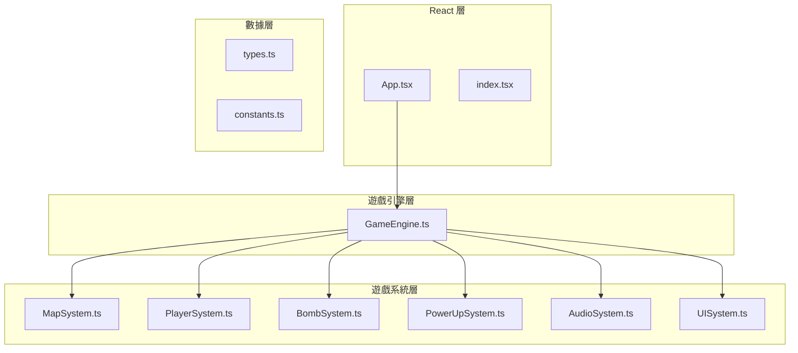

# 👨‍💻 炸彈人遊戲開發者指南

## 📋 目錄
1. [快速開始](#1-快速開始)
2. [項目結構](#2-項目結構)
3. [開發環境設置](#3-開發環境設置)
4. [代碼規範](#4-代碼規範)
5. [調試指南](#5-調試指南)
6. [功能擴展](#6-功能擴展)
7. [性能優化](#7-性能優化)
8. [測試指南](#8-測試指南)
9. [部署指南](#9-部署指南)

---

## 1. 快速開始

### 🚀 安裝和運行

```bash
# 克隆項目
git clone <repository-url>
cd bomberman-react

# 安裝依賴
npm install

# 啟動開發服務器
npm start

# 構建生產版本
npm run build

# 運行測試
npm test
```

### 📁 項目結構

```
bomberman-react/
├── public/                 # 靜態資源
├── src/                   # 源代碼
│   ├── systems/           # 遊戲系統
│   │   ├── MapSystem.ts   # 地圖系統
│   │   ├── PlayerSystem.ts # 玩家系統
│   │   ├── BombSystem.ts  # 炸彈系統
│   │   ├── PowerUpSystem.ts # 道具系統
│   │   ├── AudioSystem.ts # 音頻系統
│   │   └── UISystem.ts    # UI系統
│   ├── GameEngine.ts      # 遊戲引擎
│   ├── App.tsx            # 主應用組件
│   ├── types.ts           # 類型定義
│   ├── constants.ts       # 常數定義
│   └── index.tsx          # 應用入口
├── docs/                  # 文檔
│   ├── SEQUENCE_DIAGRAMS.md
│   ├── GAME_ARCHITECTURE.md
│   ├── GAME_FEATURES_FLOW.md
│   └── DEVELOPER_GUIDE.md
└── package.json           # 項目配置
```

---

## 2. 項目結構詳解

### 🎮 核心文件說明

| 文件 | 職責 | 關鍵方法 |
|------|------|----------|
| `GameEngine.ts` | 遊戲引擎核心 | `startGame()`, `update()`, `render()` |
| `App.tsx` | React 主組件 | `handleStartGame()`, `handleKeyDown()` |
| `types.ts` | TypeScript 類型 | `Player`, `Bomb`, `PowerUp`, `GameState` |
| `constants.ts` | 遊戲常數 | `SCREEN_WIDTH`, `TILE_SIZE`, `KEY_MAPS` |

### 🏗️ 系統架構



---

## 3. 開發環境設置

### 🛠️ 必要工具

```bash
# Node.js (版本 16+)
node --version

# npm (版本 8+)
npm --version

# Git
git --version
```

### 📦 推薦 VS Code 擴展

```json
{
  "recommendations": [
    "ms-vscode.vscode-typescript-next",
    "bradlc.vscode-tailwindcss",
    "esbenp.prettier-vscode",
    "ms-vscode.vscode-eslint",
    "ms-vscode.vscode-json"
  ]
}
```

### ⚙️ 開發配置

```json
// .vscode/settings.json
{
  "typescript.preferences.importModuleSpecifier": "relative",
  "editor.formatOnSave": true,
  "editor.codeActionsOnSave": {
    "source.fixAll.eslint": true
  },
  "emmet.includeLanguages": {
    "typescript": "html"
  }
}
```

---

## 4. 代碼規範

### 📝 TypeScript 規範

#### 1. **類型定義**
```typescript
// ✅ 好的做法
interface Player {
  id: number;
  alive: boolean;
  gridX: number;
  gridY: number;
  // ... 其他屬性
}

// ❌ 避免的做法
const player = {
  id: 1,
  alive: true,
  // 缺少類型定義
};
```

#### 2. **函數註解**
```typescript
/**
 * 移動玩家到指定位置
 * 
 * @param player 要移動的玩家
 * @param direction 移動方向
 * @param map 地圖數據
 * @returns 移動是否成功
 */
public movePlayer(player: Player, direction: Direction, map: MapTile[][]): boolean {
  // 實現邏輯
}
```

#### 3. **錯誤處理**
```typescript
// ✅ 好的做法
try {
  const result = await this.loadSounds();
  return result;
} catch (error) {
  console.warn('音頻載入失敗:', error);
  return null;
}

// ❌ 避免的做法
const result = await this.loadSounds(); // 沒有錯誤處理
```

### 🎨 代碼風格

#### 1. **命名規範**
```typescript
// 類別：PascalCase
export class GameEngine {}

// 方法：camelCase
public movePlayer() {}

// 常數：UPPER_SNAKE_CASE
export const SCREEN_WIDTH = 832;

// 私有屬性：camelCase with underscore
private _lastTime: number = 0;
```

#### 2. **註解規範**
```typescript
/**
 * 遊戲引擎核心類
 * 
 * 功能說明：
 * - 管理整個遊戲的生命週期
 * - 協調各個子系統的運行
 * - 處理用戶輸入和遊戲事件
 * 
 * 主要方法：
 * - startGame: 開始遊戲
 * - update: 更新遊戲狀態
 * - render: 渲染遊戲畫面
 */
export class GameEngine {
  // 實現
}
```

---

## 5. 調試指南

### 🐛 常見問題

#### 1. **編譯錯誤**
```bash
# 檢查 TypeScript 錯誤
npm run type-check

# 修復 ESLint 錯誤
npm run lint:fix
```

#### 2. **運行時錯誤**
```typescript
// 添加調試日誌
console.log('玩家移動到:', { x: newX, y: newY });
console.log('炸彈爆炸威力:', bomb.power);
console.log('道具收集:', powerUp.type);
```

#### 3. **性能問題**
```typescript
// 使用 performance API 測量性能
const startTime = performance.now();
// 執行代碼
const endTime = performance.now();
console.log(`執行時間: ${endTime - startTime}ms`);
```

### 🔍 調試工具

#### 1. **瀏覽器開發者工具**
- **Console** - 查看日誌和錯誤
- **Performance** - 分析性能瓶頸
- **Memory** - 檢查內存洩漏
- **Network** - 監控網絡請求

#### 2. **React 開發者工具**
- **Components** - 查看組件狀態
- **Profiler** - 分析渲染性能

#### 3. **VS Code 調試**
```json
// .vscode/launch.json
{
  "version": "0.2.0",
  "configurations": [
    {
      "name": "Launch Chrome",
      "type": "chrome",
      "request": "launch",
      "url": "http://localhost:3000",
      "webRoot": "${workspaceFolder}/src"
    }
  ]
}
```

---

## 6. 功能擴展

### 🎯 添加新道具

#### 1. **定義道具類型**
```typescript
// constants.ts
export enum PowerUpType {
  FIRE = 0,
  BOMB = 1,
  SPEED = 2,
  KICK = 3,
  PIERCE = 4,
  REMOTE = 5,
  SHIELD = 6,
  NEW_POWERUP = 7, // 新道具
}

export const POWERUP_SYMBOLS = {
  // ... 現有道具
  [PowerUpType.NEW_POWERUP]: '🆕', // 新道具符號
} as const;
```

#### 2. **實現道具效果**
```typescript
// PowerUpSystem.ts
private applyPowerUpEffect(player: Player, type: PowerUpType): void {
  switch (type) {
    // ... 現有道具
    case PowerUpType.NEW_POWERUP:
      // 實現新道具效果
      player.newAbility = true;
      break;
  }
}
```

#### 3. **更新渲染**
```typescript
// UISystem.ts
private renderPowerUp(ctx: CanvasRenderingContext2D, powerUp: PowerUp): void {
  // ... 現有代碼
  switch (powerUp.type) {
    // ... 現有道具
    case 7: symbol = '🆕'; break; // 新道具
  }
}
```

### 🎮 添加新遊戲模式

#### 1. **定義遊戲模式**
```typescript
// types.ts
export enum GameMode {
  CLASSIC = 'classic',
  TIME_ATTACK = 'time_attack',
  SURVIVAL = 'survival',
}

export interface GameState {
  // ... 現有屬性
  mode: GameMode;
  timeLimit?: number;
  score: number;
}
```

#### 2. **實現模式邏輯**
```typescript
// GameEngine.ts
private updateGameMode(): void {
  switch (this.gameState.mode) {
    case GameMode.TIME_ATTACK:
      this.updateTimeAttack();
      break;
    case GameMode.SURVIVAL:
      this.updateSurvival();
      break;
    default:
      this.updateClassic();
  }
}
```

---

## 7. 性能優化

### ⚡ 渲染優化

#### 1. **Canvas 優化**
```typescript
// 使用離屏渲染
private createTileImages(): void {
  const canvas = document.createElement('canvas');
  canvas.width = TILE_SIZE;
  canvas.height = TILE_SIZE;
  // 預渲染瓦片
}
```

#### 2. **狀態更新優化**
```typescript
// 只在必要時更新狀態
const updateGameState = () => {
  if (gameEngineRef.current) {
    const newState = gameEngineRef.current.getGameState();
    if (JSON.stringify(newState) !== JSON.stringify(gameState)) {
      setGameState(newState);
    }
  }
};
```

#### 3. **事件處理優化**
```typescript
// 防抖處理
private debounce<T extends (...args: any[]) => void>(
  func: T,
  delay: number
): T {
  let timeoutId: NodeJS.Timeout;
  return ((...args: any[]) => {
    clearTimeout(timeoutId);
    timeoutId = setTimeout(() => func(...args), delay);
  }) as T;
}
```

### 🧠 內存優化

#### 1. **對象池模式**
```typescript
class ObjectPool<T> {
  private pool: T[] = [];
  
  get(): T {
    return this.pool.pop() || this.create();
  }
  
  release(obj: T): void {
    this.reset(obj);
    this.pool.push(obj);
  }
}
```

#### 2. **垃圾回收優化**
```typescript
// 及時清理不需要的對象
public updatePowerUps(powerUps: PowerUp[]): void {
  for (let i = powerUps.length - 1; i >= 0; i--) {
    if (powerUps[i].collected) {
      powerUps.splice(i, 1);
    }
  }
}
```

---

## 8. 測試指南

### 🧪 單元測試

#### 1. **測試設置**
```typescript
// __tests__/GameEngine.test.ts
import { GameEngine } from '../GameEngine';

describe('GameEngine', () => {
  let gameEngine: GameEngine;
  let mockCanvas: HTMLCanvasElement;

  beforeEach(() => {
    mockCanvas = document.createElement('canvas');
    gameEngine = new GameEngine(mockCanvas);
  });

  test('應該正確初始化', () => {
    expect(gameEngine).toBeDefined();
  });
});
```

#### 2. **測試遊戲邏輯**
```typescript
test('玩家移動應該正確更新位置', () => {
  gameEngine.startGame();
  const player = gameEngine.getGameState().players[0];
  const initialX = player.gridX;
  
  gameEngine.handleInput('KeyD'); // 向右移動
  gameEngine.update(16); // 一幀更新
  
  expect(player.gridX).toBe(initialX + 1);
});
```

### 🔄 集成測試

#### 1. **端到端測試**
```typescript
// 使用 Playwright 進行 E2E 測試
test('遊戲完整流程', async ({ page }) => {
  await page.goto('http://localhost:3000');
  
  // 開始遊戲
  await page.click('[data-testid="start-game"]');
  
  // 移動玩家
  await page.keyboard.press('KeyD');
  
  // 放置炸彈
  await page.keyboard.press('Space');
  
  // 等待爆炸
  await page.waitForSelector('[data-testid="explosion"]');
});
```

---

## 9. 部署指南

### 🚀 生產構建

```bash
# 構建生產版本
npm run build

# 預覽構建結果
npm run preview

# 運行生產服務器
npm run serve
```

### 🌐 部署選項

#### 1. **靜態託管**
```bash
# 部署到 GitHub Pages
npm run deploy

# 部署到 Netlify
npm run build
# 上傳 build 文件夾到 Netlify
```

#### 2. **Docker 部署**
```dockerfile
# Dockerfile
FROM node:16-alpine as build
WORKDIR /app
COPY package*.json ./
RUN npm ci
COPY . .
RUN npm run build

FROM nginx:alpine
COPY --from=build /app/build /usr/share/nginx/html
EXPOSE 80
CMD ["nginx", "-g", "daemon off;"]
```

### 📊 性能監控

#### 1. **Web Vitals 監控**
```typescript
// reportWebVitals.ts
import { getCLS, getFID, getFCP, getLCP, getTTFB } from 'web-vitals';

function sendToAnalytics(metric: any) {
  // 發送到分析服務
  console.log(metric);
}

getCLS(sendToAnalytics);
getFID(sendToAnalytics);
getFCP(sendToAnalytics);
getLCP(sendToAnalytics);
getTTFB(sendToAnalytics);
```

---

## 🎯 最佳實踐

### ✅ 開發建議

1. **保持代碼整潔** - 遵循代碼規範和註解標準
2. **測試驅動開發** - 先寫測試，再寫實現
3. **性能優先** - 定期檢查性能指標
4. **文檔同步** - 及時更新文檔和註解
5. **版本控制** - 使用有意義的提交信息

### 🔧 維護建議

1. **定期重構** - 保持代碼結構清晰
2. **依賴更新** - 定期更新依賴包
3. **安全檢查** - 定期檢查安全漏洞
4. **性能監控** - 監控生產環境性能
5. **用戶反饋** - 收集和處理用戶反饋

---

## 📚 參考資源

### 🔗 相關文檔
- [React 官方文檔](https://reactjs.org/docs)
- [TypeScript 手冊](https://www.typescriptlang.org/docs)
- [Canvas API 文檔](https://developer.mozilla.org/en-US/docs/Web/API/Canvas_API)
- [Web Audio API 文檔](https://developer.mozilla.org/en-US/docs/Web/API/Web_Audio_API)

### 🛠️ 開發工具
- [VS Code](https://code.visualstudio.com/)
- [Chrome DevTools](https://developers.google.com/web/tools/chrome-devtools)
- [React DevTools](https://chrome.google.com/webstore/detail/react-developer-tools)
- [TypeScript Playground](https://www.typescriptlang.org/play)

---

*此開發者指南將隨著項目的發展持續更新和完善。如有問題或建議，請隨時提出。*
