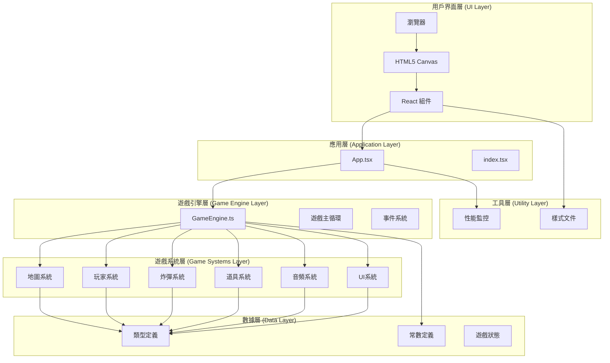
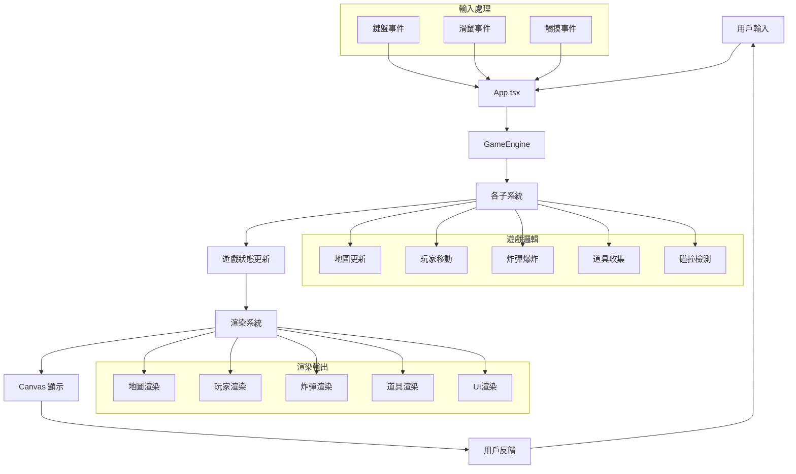

# 🏗️ 炸彈人遊戲架構總覽

## 📋 目錄
1. [整體架構](#1-整體架構)
2. [系統職責](#2-系統職責)
3. [數據流向](#3-數據流向)
4. [技術棧](#4-技術棧)
5. [設計模式](#5-設計模式)
6. [性能優化](#6-性能優化)

---

## 1. 整體架構



---

## 2. 系統職責

### 🎮 核心系統

| 系統 | 職責 | 主要方法 |
|------|------|----------|
| **GameEngine** | 遊戲引擎核心，協調所有系統 | `startGame()`, `update()`, `render()` |
| **MapSystem** | 地圖生成、渲染、碰撞檢測 | `generateMap()`, `render()`, `isWall()` |
| **PlayerSystem** | 玩家管理、移動、渲染 | `createPlayer()`, `movePlayer()`, `render()` |
| **BombSystem** | 炸彈放置、爆炸、連鎖反應 | `placeBomb()`, `explodeBomb()`, `kickBomb()` |
| **PowerUpSystem** | 道具生成、收集、效果應用 | `generatePowerUp()`, `collectPowerUp()`, `applyEffect()` |
| **AudioSystem** | 音效和背景音樂管理 | `playSound()`, `playMusic()`, `setVolume()` |
| **UISystem** | 用戶界面渲染 | `renderHUD()`, `renderMenu()`, `renderGameOver()` |

### 🔧 支持系統

| 系統 | 職責 | 主要功能 |
|------|------|----------|
| **App.tsx** | React 應用主組件 | 狀態管理、事件處理、生命週期 |
| **types.ts** | TypeScript 類型定義 | 接口定義、類型安全 |
| **constants.ts** | 遊戲常數定義 | 配置參數、枚舉值 |
| **reportWebVitals.ts** | 性能監控 | Web Vitals 測量 |

---

## 3. 數據流向



---

## 4. 技術棧

### 🎯 前端技術

| 技術 | 版本 | 用途 |
|------|------|------|
| **React** | 18.x | UI 框架 |
| **TypeScript** | 4.x | 類型安全 |
| **HTML5 Canvas** | - | 遊戲渲染 |
| **CSS3** | - | 樣式設計 |
| **Web Audio API** | - | 音頻處理 |

### 🛠️ 開發工具

| 工具 | 用途 |
|------|------|
| **Create React App** | 項目腳手架 |
| **ESLint** | 代碼檢查 |
| **Prettier** | 代碼格式化 |
| **Webpack** | 模組打包 |
| **Babel** | JavaScript 編譯 |

### 📦 依賴管理

| 包 | 用途 |
|----|------|
| **react** | React 核心 |
| **react-dom** | DOM 渲染 |
| **web-vitals** | 性能監控 |
| **@types/react** | React 類型定義 |

---

## 5. 設計模式

### 🏗️ 架構模式

#### 1. **模組化架構 (Modular Architecture)**
```typescript
// 每個系統都是獨立的模組
export class MapSystem {
  // 地圖相關功能
}

export class PlayerSystem {
  // 玩家相關功能
}
```

#### 2. **事件驅動模式 (Event-Driven Pattern)**
```typescript
// 用戶輸入觸發事件
const handleKeyDown = (event: KeyboardEvent) => {
  const inputEvent = this.handleInput(event.key);
  if (inputEvent) {
    this.inputQueue.push(inputEvent);
  }
};
```

#### 3. **狀態管理模式 (State Management Pattern)**
```typescript
// 集中式狀態管理
interface GameState {
  state: GameStateType;
  players: Player[];
  bombs: Bomb[];
  powerUps: PowerUp[];
  // ...
}
```

### 🎨 設計原則

#### 1. **單一職責原則 (SRP)**
- 每個系統只負責一個特定功能
- 地圖系統只處理地圖相關邏輯
- 玩家系統只處理玩家相關邏輯

#### 2. **開放封閉原則 (OCP)**
- 對擴展開放，對修改封閉
- 可以輕鬆添加新的道具類型
- 可以擴展新的遊戲功能

#### 3. **依賴倒置原則 (DIP)**
- 高層模組不依賴低層模組
- 通過接口進行依賴注入
- 便於測試和維護

---

## 6. 性能優化

### ⚡ 渲染優化

#### 1. **Canvas 優化**
```typescript
// 離屏渲染瓦片圖片
private createTileImages(): void {
  const canvas = document.createElement('canvas');
  // 預渲染瓦片，避免每幀重繪
}
```

#### 2. **狀態更新優化**
```typescript
// 只在狀態改變時更新
const updateGameState = () => {
  if (gameEngineRef.current) {
    const state = gameEngineRef.current.getGameState();
    setGameState(state); // 觸發重新渲染
  }
};
```

#### 3. **事件處理優化**
```typescript
// 防抖處理，避免過度觸發
if (Date.now() - player.lastBombTime < 500) return;
```

### 🎯 內存優化

#### 1. **對象池模式**
```typescript
// 重用炸彈對象，避免頻繁創建
private bombIdCounter = 0;
const bomb: Bomb = {
  id: `bomb_${this.bombIdCounter++}`,
  // ...
};
```

#### 2. **垃圾回收優化**
```typescript
// 及時清理已收集的道具
public updatePowerUps(powerUps: PowerUp[]): void {
  for (let i = powerUps.length - 1; i >= 0; i--) {
    if (powerUps[i].collected) {
      powerUps.splice(i, 1);
    }
  }
}
```

### 📊 性能監控

#### 1. **Web Vitals 監控**
```typescript
// 監控核心性能指標
reportWebVitals(console.log);
```

#### 2. **FPS 控制**
```typescript
// 60 FPS 遊戲循環
const gameLoop = (currentTime: number) => {
  const deltaTime = currentTime - this.lastTime;
  this.lastTime = currentTime;
  
  this.update(deltaTime);
  this.render();
  
  this.animationId = requestAnimationFrame(this.gameLoop);
};
```

---

## 🎯 總結

這個炸彈人遊戲採用了現代化的前端架構設計，具有以下特點：

### ✅ 優點
- **模組化設計** - 易於維護和擴展
- **類型安全** - TypeScript 提供編譯時檢查
- **性能優化** - 多種優化策略確保流暢運行
- **可讀性強** - 詳細的註解和文檔
- **可測試性** - 清晰的接口和依賴關係

### 🔄 改進空間
- **單元測試** - 可以添加更多測試用例
- **錯誤處理** - 可以加強異常處理機制
- **國際化** - 可以支持多語言
- **無障礙** - 可以添加無障礙功能

### 🚀 未來發展
- **多人對戰** - 支持網絡多人遊戲
- **關卡編輯器** - 允許用戶自定義地圖
- **成就系統** - 添加遊戲成就和排行榜
- **移動端適配** - 優化觸摸操作體驗

---

*此文檔將隨著項目的發展持續更新和完善。*
