# 🎮 炸彈人遊戲功能流程圖

## 📋 目錄
1. [遊戲功能總覽](#1-遊戲功能總覽)
2. [核心遊戲機制](#2-核心遊戲機制)
3. [道具系統流程](#3-道具系統流程)
4. [特殊功能流程](#4-特殊功能流程)
5. [UI 交互流程](#5-ui-交互流程)
6. [音效系統流程](#6-音效系統流程)

---

## 1. 遊戲功能總覽

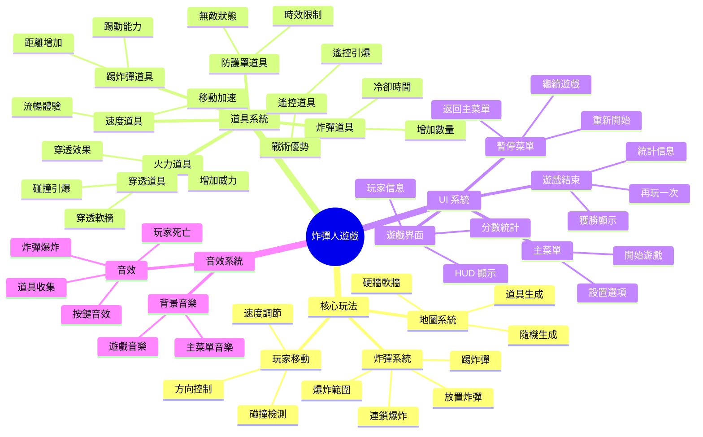

---

## 2. 核心遊戲機制

### 🎯 玩家移動機制

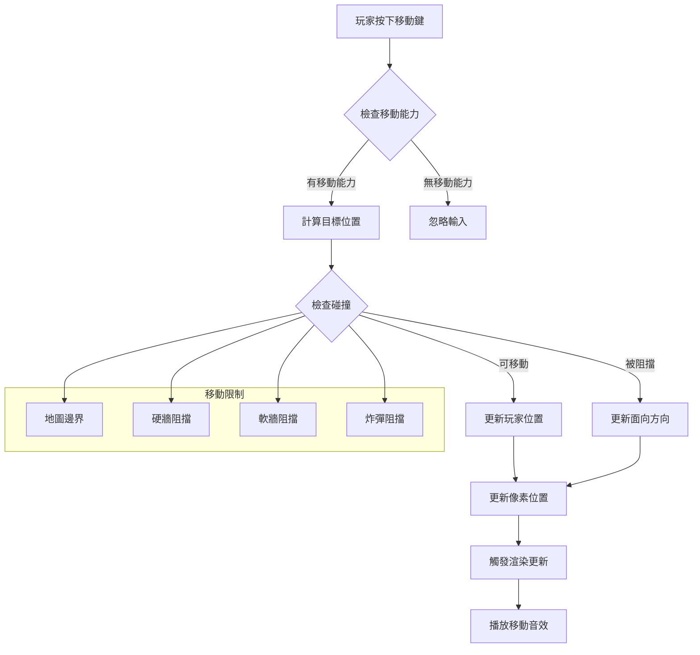

### 💣 炸彈系統機制

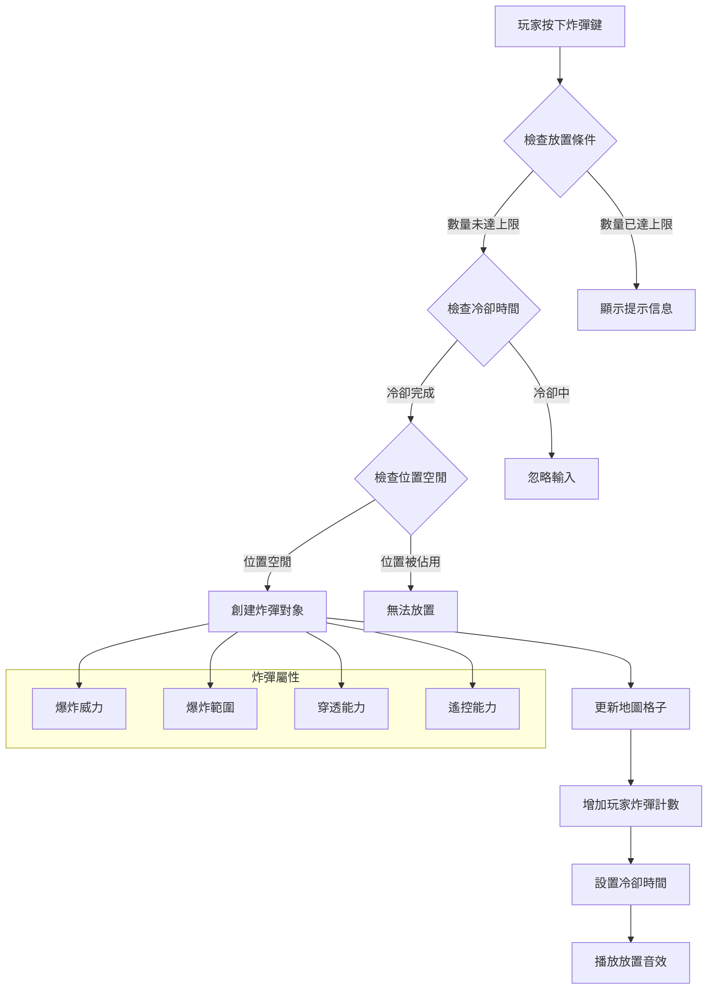

### 🔥 爆炸機制

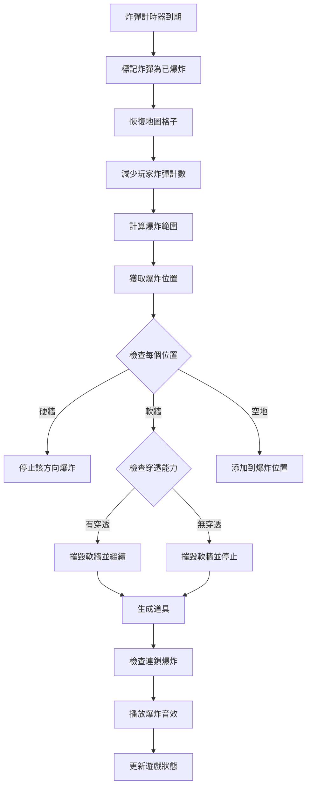

---

## 3. 道具系統流程

### 🎁 道具生成流程

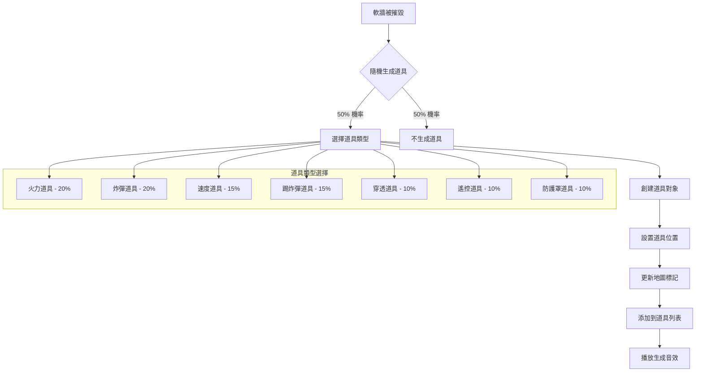

### 🎯 道具收集流程

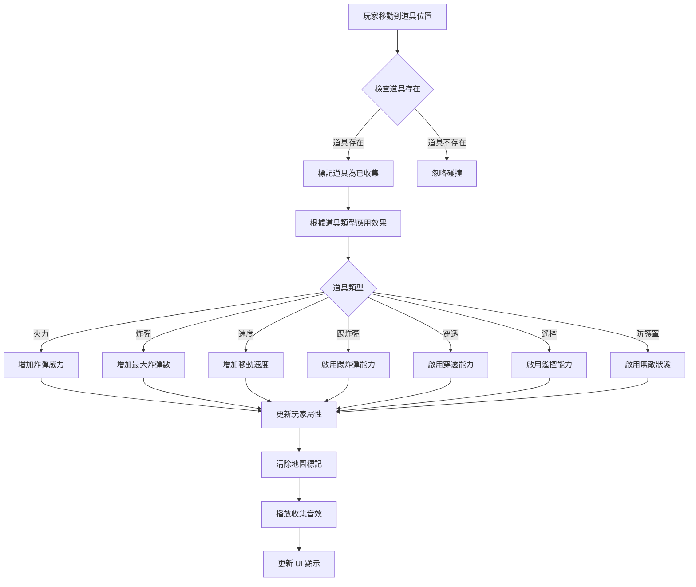

---

## 4. 特殊功能流程

### 👟 踢炸彈功能

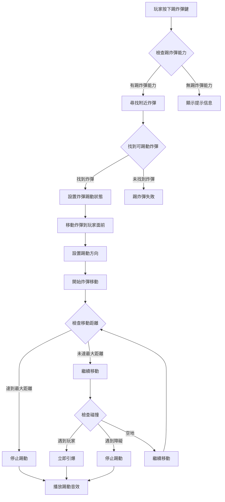

### 💥 穿透爆炸功能

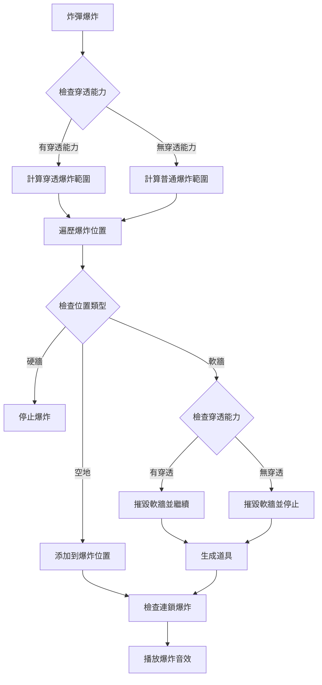

---

## 5. UI 交互流程

### 🎮 主菜單交互

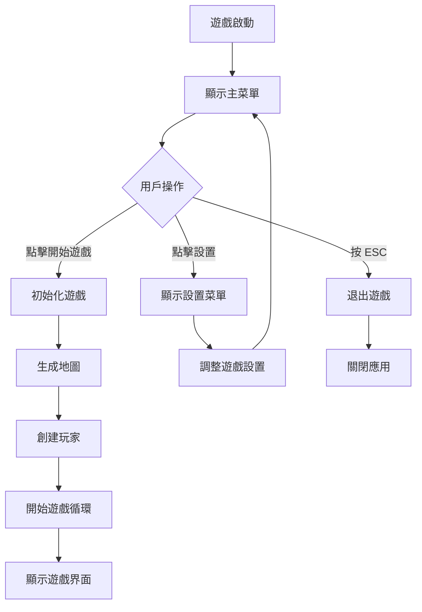

### ⏸️ 暫停菜單交互

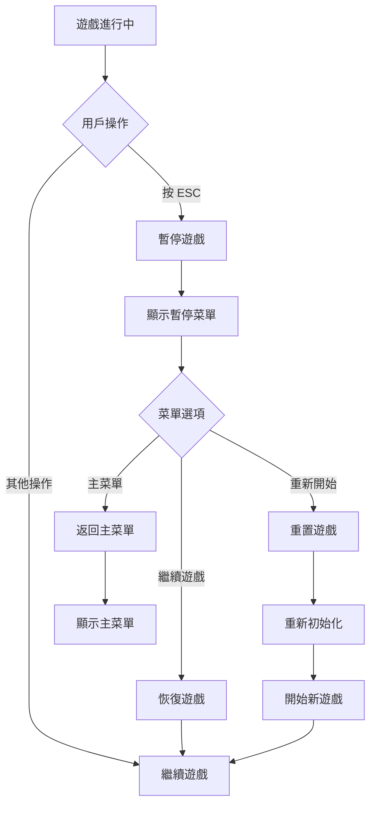

### 🏆 遊戲結束交互

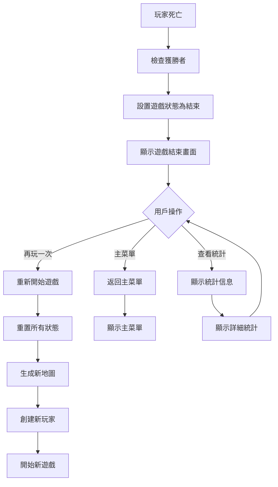

---

## 6. 音效系統流程

### 🎵 音效播放流程

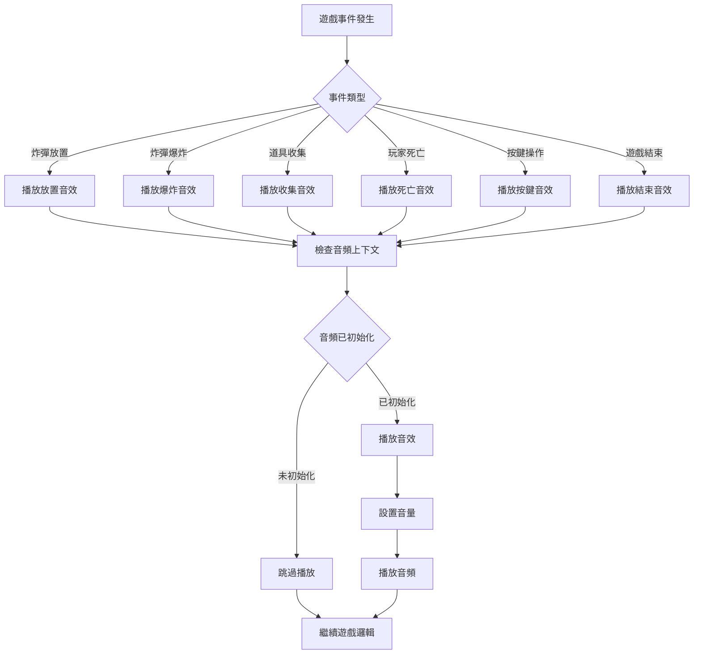

### 🎶 背景音樂流程

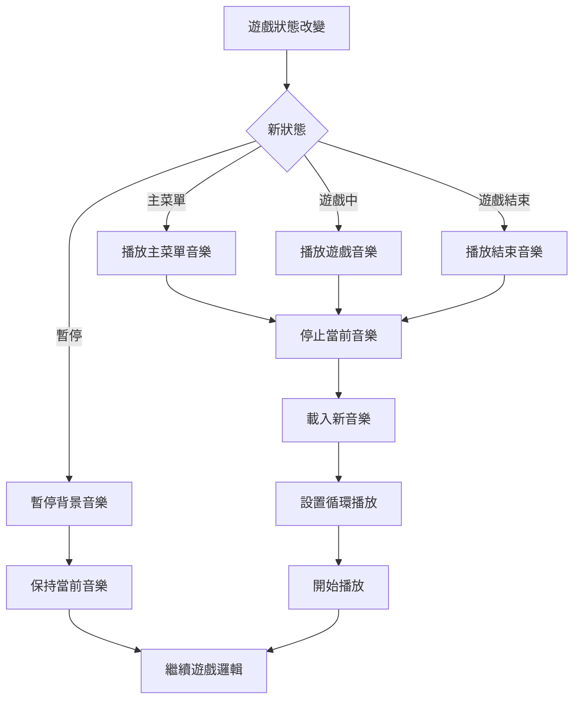

---

## 🎯 功能特點總結

### ✅ 核心功能
- **流暢的玩家移動** - 支持方向控制和碰撞檢測
- **智能炸彈系統** - 支持放置、爆炸、連鎖反應
- **豐富的道具系統** - 7種不同類型的道具
- **特殊遊戲機制** - 踢炸彈、穿透爆炸等

### 🎨 UI/UX 功能
- **直觀的菜單系統** - 主菜單、暫停菜單、遊戲結束
- **實時 HUD 顯示** - 玩家信息、分數、時間
- **響應式設計** - 適配不同屏幕尺寸

### 🔊 音效功能
- **完整的音效系統** - 遊戲事件音效
- **背景音樂** - 不同場景的音樂
- **音量控制** - 可調節的音量設置

### ⚡ 性能功能
- **60 FPS 流暢運行** - 優化的遊戲循環
- **內存管理** - 對象池和垃圾回收優化
- **性能監控** - Web Vitals 性能指標

---

*此文檔詳細描述了炸彈人遊戲的所有功能流程，可以作為開發、測試和維護的參考指南。*
