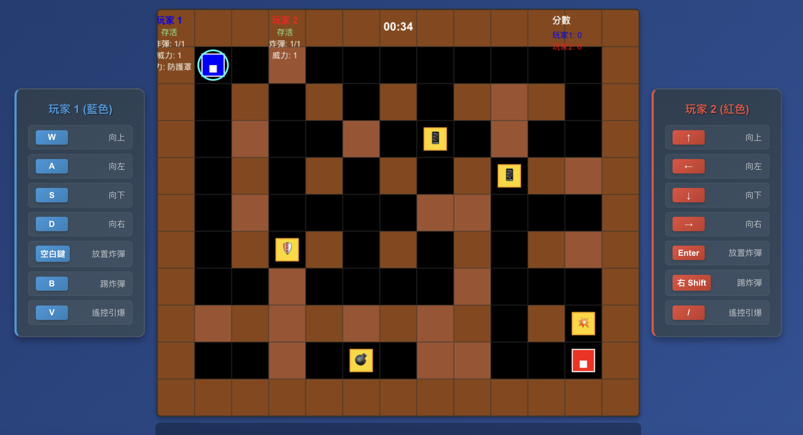

# 炸彈超人 React 版

這是一個使用 React + TypeScript 重新製作的炸彈超人遊戲，基於原有的 Python 版本改寫而成。

## 🎮 遊戲預覽



## ✨ 功能特色

- 🎮 **雙人對戰模式** - 支持本地雙人對戰
- 💣 **完整炸彈系統** - 炸彈放置、爆炸、連鎖反應
- 🎁 **豐富道具系統** - 7種不同類型的道具
- 🛡️ **特殊能力系統** - 踢炸彈、遙控引爆、防護罩等
- 🎵 **音效系統** - 完整的音效和背景音樂
- 📱 **響應式設計** - 適配不同屏幕尺寸
- ⚡ **60 FPS** - 流暢的遊戲體驗

## 🎯 遊戲控制

### 玩家 1 (藍色)
- **移動**: W A S D 鍵
- **放置炸彈**: 空白鍵
- **踢炸彈**: B 鍵
- **遙控引爆**: V 鍵

### 玩家 2 (紅色)
- **移動**: 方向鍵
- **放置炸彈**: Enter 鍵
- **踢炸彈**: 右 Shift 鍵
- **遙控引爆**: / 鍵

### 通用控制
- **暫停/繼續**: ESC 鍵

## 🎁 道具系統

| 道具 | 符號 | 效果 |
|------|------|------|
| 🔥 火焰道具 | 增加炸彈威力 |
| 💣 炸彈道具 | 增加可放置炸彈數量 |
| ⚡ 速度道具 | 增加移動速度 |
| 👟 踢炸彈道具 | 可以踢動炸彈 |
| 💥 穿透道具 | 炸彈可以穿透軟牆 |
| 📱 遙控道具 | 可以遙控引爆炸彈 |
| 🛡️ 防護罩道具 | 10秒內無敵狀態 |

## 🚀 快速開始

### 前置要求
- Node.js 14.0 或更高版本
- npm 或 yarn

### 安裝和運行

```bash
# 1. 克隆項目
git clone <repository-url>
cd bomberman-react

# 2. 安裝依賴
npm install

# 3. 啟動開發服務器
npm start
```

遊戲將在 http://localhost:3000 上運行！

### 構建生產版本

```bash
# 構建
npm run build

# 本地預覽
npm run serve
```

## 📁 項目結構

```
bomberman-react/
├── src/
│   ├── systems/              # 遊戲系統
│   │   ├── MapSystem.ts      # 地圖系統
│   │   ├── PlayerSystem.ts   # 玩家系統
│   │   ├── BombSystem.ts     # 炸彈系統
│   │   ├── PowerUpSystem.ts  # 道具系統
│   │   ├── AudioSystem.ts    # 音頻系統
│   │   └── UISystem.ts       # UI系統
│   ├── types.ts              # TypeScript 類型定義
│   ├── constants.ts          # 遊戲常數
│   ├── GameEngine.ts         # 遊戲引擎核心
│   ├── GameTest.ts           # 遊戲測試
│   ├── App.tsx              # React 主組件
│   └── App.css              # 樣式文件
├── docs/                     # 完整文檔
│   ├── GAME_DESIGN_DOCUMENT.md
│   ├── TECHNICAL_ARCHITECTURE.md
│   ├── DEVELOPMENT_ROADMAP.md
│   ├── API_REFERENCE.md
│   └── PROJECT_SUMMARY.md
├── public/                   # 靜態資源
├── README.md                 # 項目說明
├── QUICK_START.md           # 快速啟動指南
└── package.json             # 項目配置
```

## 🏗️ 技術架構

### 核心技術
- **React 19.1.1** - 前端框架
- **TypeScript 4.9.5** - 類型安全
- **HTML5 Canvas 2D** - 遊戲渲染
- **Web Audio API** - 音頻處理
- **Create React App** - 構建工具

### 系統架構
```
React App
├── GameEngine (遊戲引擎核心)
├── MapSystem (地圖系統)
├── PlayerSystem (玩家系統)
├── BombSystem (炸彈系統)
├── PowerUpSystem (道具系統)
├── AudioSystem (音頻系統)
└── UISystem (UI系統)
```

## 🎨 設計特色

### 視覺設計
- **簡潔風格** - 使用幾何圖形和純色設計
- **清晰對比** - 高對比度的顏色搭配
- **動畫效果** - 流暢的動畫和過渡效果
- **響應式設計** - 適配不同屏幕尺寸

### 用戶體驗
- **直觀控制** - 簡單易懂的鍵盤控制
- **即時反饋** - 即時的視覺和音頻反饋
- **流暢遊戲** - 60fps 的流暢遊戲體驗
- **易於學習** - 新用戶可以快速上手

## 📊 性能指標

- **幀率**: 穩定 60fps
- **內存使用**: < 100MB
- **加載時間**: < 3秒
- **文件大小**: 65.94 kB (gzipped)

## 🧪 測試

### 運行測試
```bash
# 單元測試
npm test

# 構建測試
npm run build

# 代碼檢查
npm run lint
```

### 測試覆蓋
- 遊戲引擎測試
- 各系統單元測試
- 集成測試
- 性能測試

## 📚 文檔

完整的技術文檔位於 `docs/` 目錄：

- **[遊戲設計文檔](docs/GAME_DESIGN_DOCUMENT.md)** - 完整的遊戲設計規劃
- **[技術架構文檔](docs/TECHNICAL_ARCHITECTURE.md)** - 深入的技術架構說明
- **[開發路線圖](docs/DEVELOPMENT_ROADMAP.md)** - 項目開發計劃
- **[API 參考文檔](docs/API_REFERENCE.md)** - 完整的 API 使用指南
- **[項目總結](docs/PROJECT_SUMMARY.md)** - 項目成果總結

## 🔄 與原版對比

| 特性 | Python 版本 | React 版本 |
|------|-------------|------------|
| **平台** | 桌面應用 | 網頁應用 |
| **技術棧** | Pygame + Python | React + TypeScript |
| **部署** | 需要安裝 Python | 只需瀏覽器 |
| **跨平台** | 需要編譯 | 天然跨平台 |
| **更新** | 需要重新安裝 | 自動更新 |
| **分享** | 需要分發文件 | 只需分享鏈接 |
| **功能** | 完整 | 完整 |
| **性能** | 優秀 | 優秀 |
| **維護** | 中等 | 優秀 |

## 🐛 已知問題

- 音頻在某些瀏覽器中可能需要用戶交互才能播放
- 移動設備上的觸控支持尚未實現
- 網絡多人遊戲功能尚未開發

## 🔮 未來計劃

### 短期目標
- [ ] 修復 ESLint 警告
- [ ] 添加單元測試
- [ ] 優化音頻系統
- [ ] 添加觸控支持

### 中期目標
- [ ] 網絡多人遊戲
- [ ] 移動端優化
- [ ] 更多遊戲模式
- [ ] 成就系統

### 長期目標
- [ ] 3D 版本
- [ ] 雲端對戰平台
- [ ] AI 對手
- [ ] 社區功能

## 🤝 貢獻

歡迎提交 Issue 和 Pull Request 來改進這個項目！

### 貢獻指南
1. Fork 本項目
2. 創建功能分支 (`git checkout -b feature/AmazingFeature`)
3. 提交更改 (`git commit -m 'Add some AmazingFeature'`)
4. 推送到分支 (`git push origin feature/AmazingFeature`)
5. 開啟 Pull Request

## 📄 許可證

本項目使用 MIT 許可證 - 查看 [LICENSE](LICENSE) 文件了解詳情。

## 📞 支持

如有問題或建議，請：
1. 查看 [文檔](docs/)
2. 提交 [Issue](../../issues)
3. 聯繫項目維護者

---

**享受遊戲！** 🎮✨