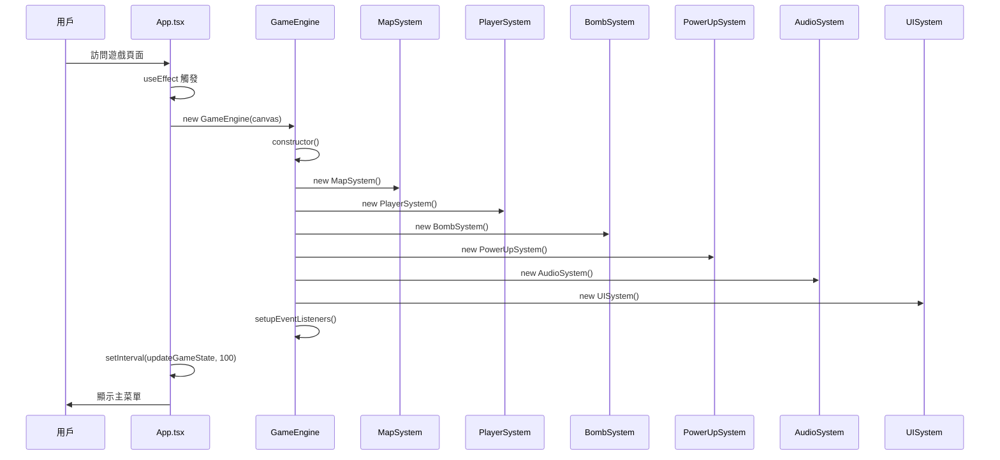
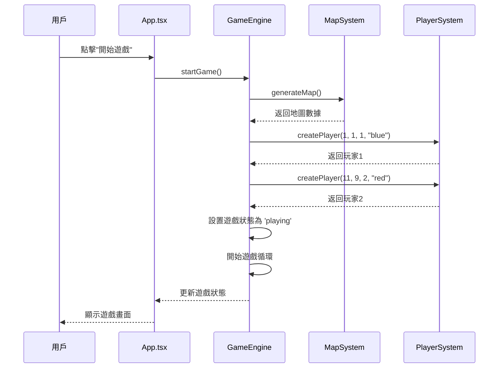
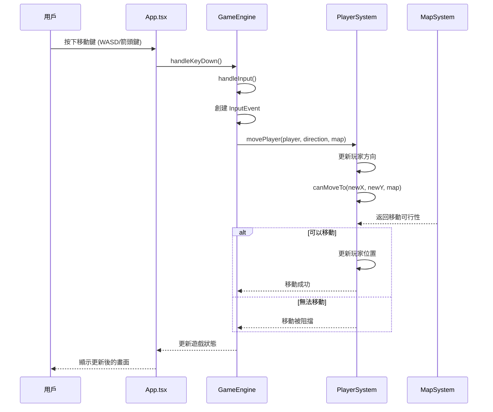
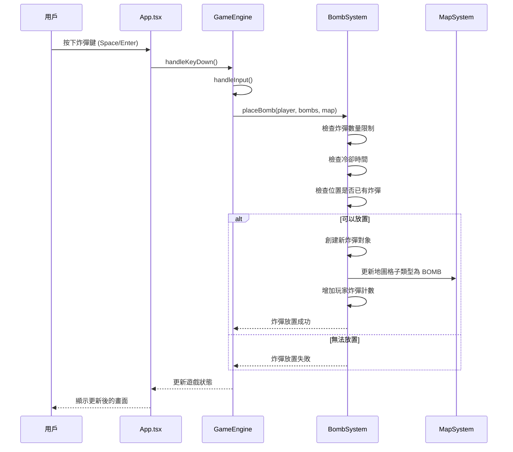
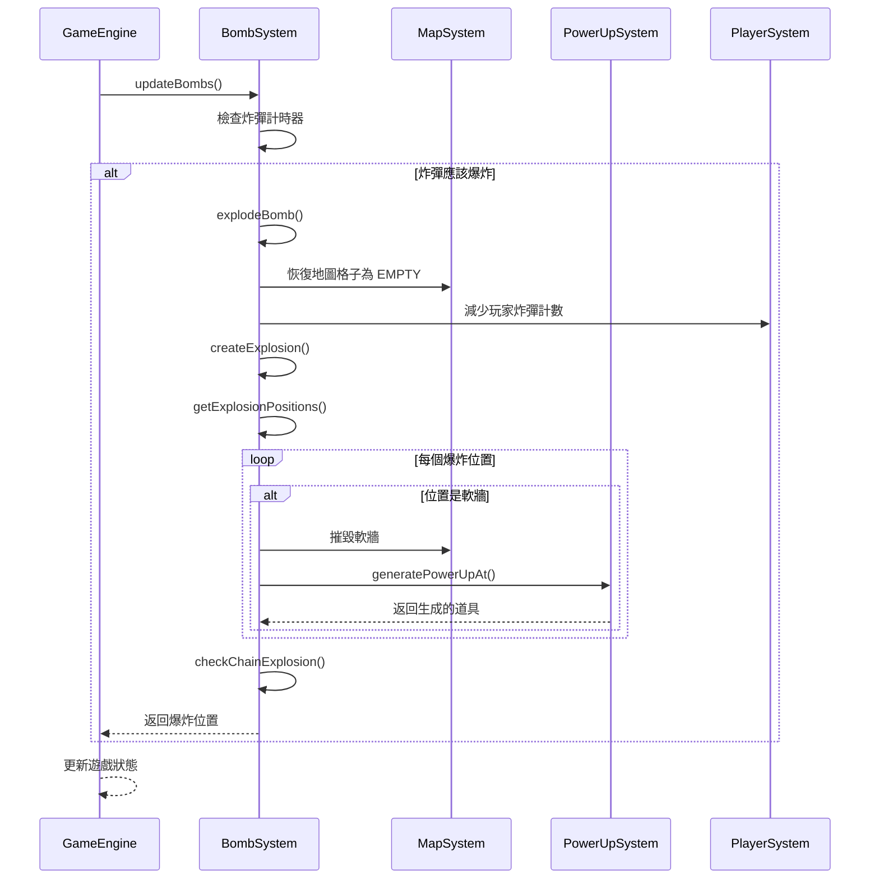
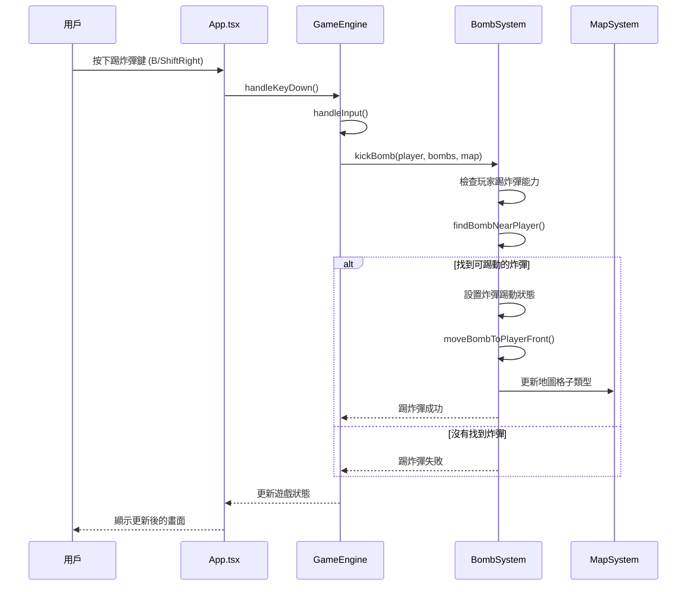
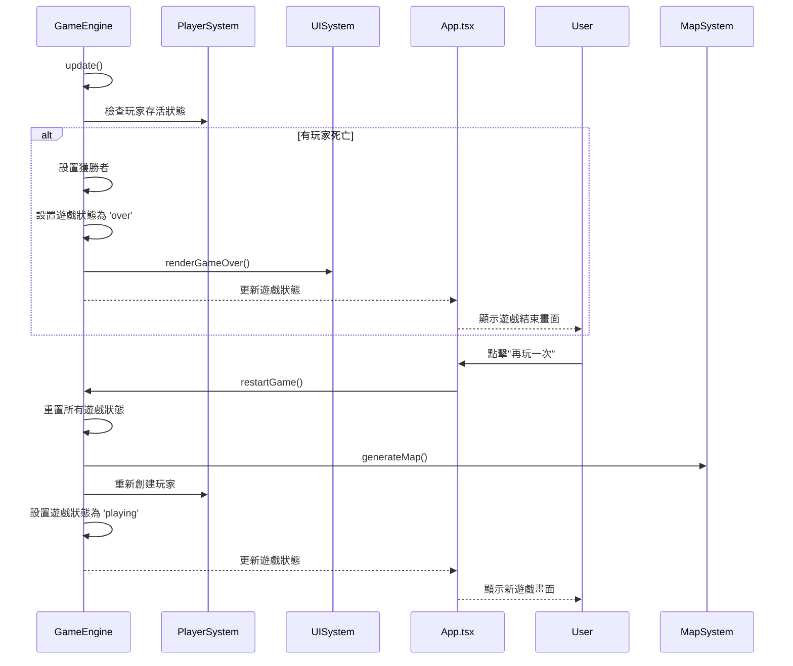
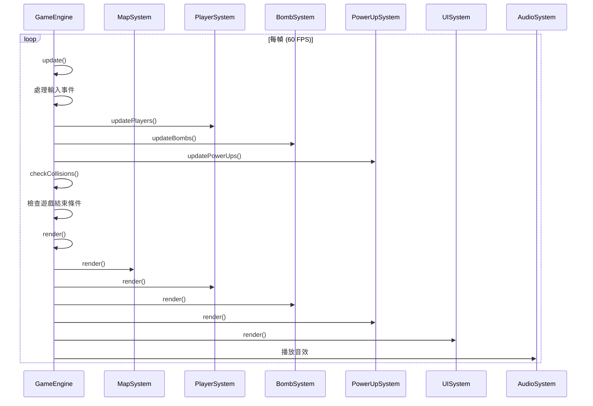
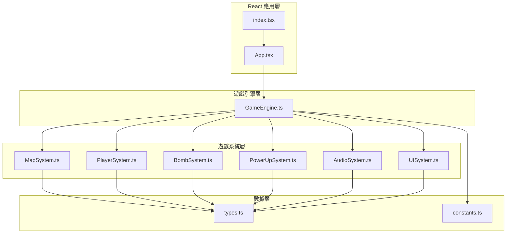

# 🎮 炸彈人遊戲 Sequence 流程圖文檔

## 📋 目錄
1. [遊戲初始化流程](#1-遊戲初始化流程)
2. [遊戲開始流程](#2-遊戲開始流程)
3. [玩家移動流程](#3-玩家移動流程)
4. [炸彈放置流程](#4-炸彈放置流程)
5. [炸彈爆炸流程](#5-炸彈爆炸流程)
6. [道具收集流程](#6-道具收集流程)
7. [踢炸彈流程](#7-踢炸彈流程)
8. [遊戲結束流程](#8-遊戲結束流程)
9. [遊戲主循環流程](#9-遊戲主循環流程)
10. [系統架構圖](#10-系統架構圖)

---

## 1. 遊戲初始化流程



**說明：**
- 用戶訪問頁面觸發 React 組件掛載
- App.tsx 初始化遊戲引擎和各個子系統
- 設置事件監聽器和定期狀態更新
- 顯示主菜單等待用戶操作

---

## 2. 遊戲開始流程



**說明：**
- 用戶點擊開始遊戲按鈕
- 生成隨機地圖和創建兩個玩家
- 設置遊戲狀態並開始主循環
- 更新 UI 顯示遊戲畫面

---

## 3. 玩家移動流程



**說明：**
- 用戶按下移動鍵觸發輸入事件
- 檢查移動目標位置是否可行
- 更新玩家位置和方向
- 實時更新遊戲畫面

---

## 4. 炸彈放置流程



**說明：**
- 用戶按下炸彈鍵觸發放置事件
- 檢查各種放置條件（數量、冷卻、位置）
- 創建炸彈對象並更新地圖
- 更新玩家炸彈計數

---

## 5. 炸彈爆炸流程



**說明：**
- 定期檢查炸彈是否應該爆炸
- 計算爆炸範圍並摧毀軟牆
- 有機率在軟牆位置生成道具
- 檢查連鎖爆炸效果

---

## 6. 道具收集流程

```mermaid
sequenceDiagram
    participant GameEngine as GameEngine
    participant PlayerSystem as PlayerSystem
    participant PowerUpSystem as PowerUpSystem
    participant MapSystem as MapSystem

    GameEngine->>GameEngine: checkCollisions()
    GameEngine->>PlayerSystem: 檢查玩家位置
    loop 每個玩家
        alt 玩家在道具位置
            GameEngine->>PowerUpSystem: collectPowerUp(player, powerUp)
            PowerUpSystem->>PowerUpSystem: 標記道具為已收集
            PowerUpSystem->>PowerUpSystem: applyPowerUpEffect()
            alt 道具類型
                case FIRE: PowerUpSystem->>PlayerSystem: 增加炸彈威力
                case BOMB: PowerUpSystem->>PlayerSystem: 增加最大炸彈數
                case SPEED: PowerUpSystem->>PlayerSystem: 增加移動速度
                case KICK: PowerUpSystem->>PlayerSystem: 啟用踢炸彈能力
                case PIERCE: PowerUpSystem->>PlayerSystem: 啟用穿透能力
                case REMOTE: PowerUpSystem->>PlayerSystem: 啟用遙控能力
                case SHIELD: PowerUpSystem->>PlayerSystem: 啟用防護罩
            end
            PowerUpSystem->>MapSystem: 清除地圖道具標記
        end
    end
    GameEngine-->>GameEngine: 更新遊戲狀態
```

**說明：**
- 檢查玩家與道具的碰撞
- 根據道具類型應用不同效果
- 更新玩家能力和地圖狀態
- 提供視覺和音效反饋

---

## 7. 踢炸彈流程



**說明：**
- 用戶按下踢炸彈鍵
- 檢查玩家是否具有踢炸彈能力
- 尋找附近可踢動的炸彈
- 設置炸彈移動狀態和方向

---

## 8. 遊戲結束流程



**說明：**
- 檢查玩家存活狀態
- 設置獲勝者和遊戲結束狀態
- 提供重新開始功能
- 重置所有遊戲數據

---

## 9. 遊戲主循環流程



**說明：**
- 60 FPS 的遊戲循環
- 每幀更新所有系統
- 處理輸入、碰撞檢測、渲染
- 播放相應的音效

---

## 10. 系統架構圖



---

## 🎯 遊戲設計核心邏輯

### 1. **模組化設計**
- 每個系統都有明確的職責
- 系統間通過接口進行通信
- 便於維護和擴展

### 2. **事件驅動架構**
- 用戶輸入觸發事件
- 事件在系統間傳遞
- 狀態更新驅動渲染

### 3. **狀態管理**
- 集中式遊戲狀態管理
- 狀態變更觸發重新渲染
- 確保數據一致性

### 4. **碰撞檢測**
- 網格基礎的碰撞檢測
- 實時位置驗證
- 多層次碰撞處理

### 5. **時間管理**
- 基於時間的遊戲邏輯
- 冷卻時間控制
- 動畫和效果同步

---

## 📝 使用說明

這些 sequence 流程圖展示了炸彈人遊戲的完整設計邏輯，從初始化到遊戲循環，每個系統都有明確的職責和交互方式。可以用於：

1. **開發參考** - 理解系統間的交互關係
2. **調試輔助** - 追蹤問題的數據流向
3. **功能擴展** - 了解如何添加新功能
4. **代碼維護** - 快速理解現有代碼結構
5. **團隊協作** - 統一對系統架構的理解

---

## 🔄 更新記錄

- **2024-01-XX** - 初始版本，包含所有主要流程圖
- **2024-01-XX** - 添加系統架構圖和設計說明
- **2024-01-XX** - 完善註解和文檔結構

---

*此文檔將隨著遊戲功能的更新而持續維護和改進。*
